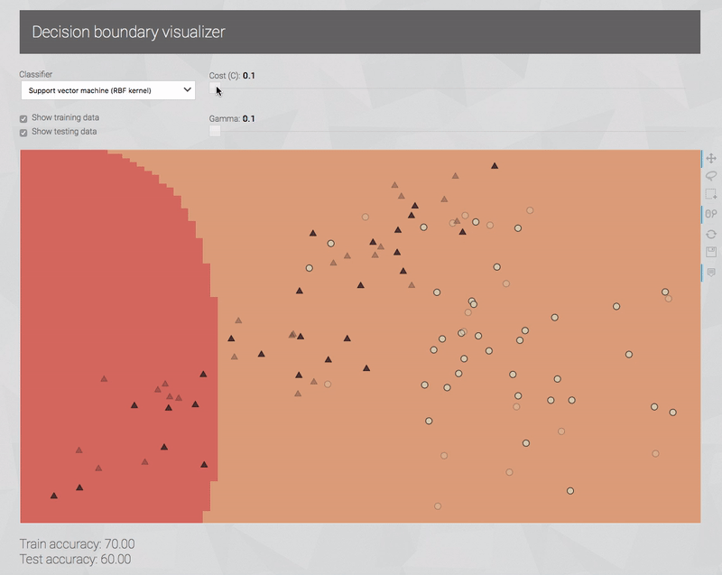

# decision_boundary_viz

A web app for visualizing decision boundaries of classifiers.

Supports 2-dimensional data and the following classifiers and their parameters:

* k-Nearest Neighbors
    * Number of neighbors
    * Weight function
        * Uniform weights
        * Points weighted by the inverse of their distance
* Random forest
    * The number of trees in the forest
    * The maximum depth of trees
* Support vector machine (RBF kernel)
    * Cost (C)
    * Gamma

## Demo



## Dependencies

* [NumPy](http://www.numpy.org/) (numerical operations)
* [scikit-learn](http://scikit-learn.org/) (classifiers)
* [Bokeh](http://bokeh.pydata.org/) (interactive visualizations)
* [Flask](http://flask.pocoo.org/) (web framework)

```
conda create -n decision_boundary_viz python=3.5 numpy=1.11 scikit-learn=0.18 bokeh=0.12.4 flask=0.12
```
